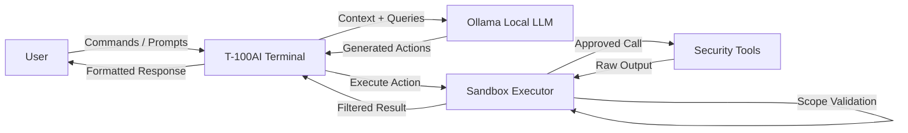

# T-100AI — AI-Powered Offensive Security Terminal

[](https://python.org)
[](https://ollama.ai)
[](LICENSE)
[](https://github.com/Ruby570bocadito/T-100AI/actions)
[]()
[]()

**T-100AI** is a local AI-powered offensive security terminal. It combines a local LLM (Ollama) with a sandboxed execution engine, AI skills for pentesting, and a plugin system — all operating 100% offline with zero data leakage.

## Architecture



## Quick Start

```bash
# 1. Clone
git clone https://github.com/Ruby570bocadito/T-100AI.git
cd T-100AI

# 2. Install
pip install -r requirements.txt

# 3. Ensure Ollama is running
ollama pull mistral:7b

# 4. Launch
python -m t100ai.cli.main
```

> **Requirements:** Python 3.10+, Ollama installed and running, Linux/WSL environment.

## Features

| Feature | Description |
|---------|-------------|
| **Local LLM Integration** | Full Ollama integration (mistral, llama3, qwen, gemma, deepseek). Zero data leaves your machine. |
| **Sandboxed Execution** | Scope validation, rate limiting, auto-sudo approval, intelligent blocklist. |
| **MCP Advanced** | Tool templates, chaining, auto-discovery, output parsers, interactive prompt builder. |
| **AI Skills** | Recon, OSINT, Web, Post-Exploitation, Forensics, Active Directory, Reporting. |
| **Multi-Agent Orchestrator** | Parallel sub-agents: Recon → Exploit → Analyst → Reporter. Conditional workflows. |
| **Workflow Engine** | Conditional steps, loops, variables, interactive editor, real-time execution. |
| **Guardrails** | Prompt injection detection, sensitive data filtering, tool approval gates, audit logs. |
| **Plugin System** | Custom skill loader, community plugins, extensible tool registry. |
| **Offline Mode** | Full capability without internet. Air-gapped by design. No telemetry. |

## Commands

| Command | Description |
|---------|-------------|
| `/help` | Show interactive help menu |
| `/scan <target>` | Run AI-guided reconnaissance |
| `/recon <domain>` | OSINT and subdomain enumeration |
| `/post <session>` | Post-exploitation actions |
| `/forensics <path>` | Forensic analysis on target |
| `/workflow <name>` | Execute saved workflow |
| `/skill <name>` | Load a security skill |
| `/sandbox <cmd>` | Run command in sandbox |
| `/config` | Edit configuration |
| `/quit` | Exit |

## Project Structure

```
T-100AI/
├── pyproject.toml                    # Build config + dependencies
├── requirements.txt                  # All dependencies
├── run.sh / run.bat                  # Quick launch scripts
├── Dockerfile                        # Multi-stage Kali + Python
├── docker-compose.yml                # T-100AI + Ollama stack
├── .github/workflows/ci.yml          # CI pipeline (lint + test + coverage)
├── src/t100ai/
│   ├── cli/
│   │   ├── main.py                   # Typer CLI entry point + REPL
│   │   └── session_commands.py       # Session command handlers
│   ├── core/
│   │   ├── engine.py                 # Main execution engine (2000+ lines)
│   │   ├── config.py                 # Configuration (Pydantic)
│   │   ├── session.py                # Session management
│   │   ├── sandbox.py                # Sandbox executor
│   │   ├── guardrails.py             # Prompt injection + data filtering
│   │   ├── permissions.py            # Permission levels
│   │   ├── llm_handler.py            # LLM interaction handler
│   │   ├── command_executor.py       # Command execution
│   │   ├── command_router.py         # Command routing
│   │   ├── templates.py              # Prompt templates
│   │   ├── models.py                 # Data models
│   │   ├── audit.py                  # Audit logging
│   │   ├── engagement.py             # Engagement tracking
│   │   ├── report_generator.py       # Report generation
│   │   ├── session_manager.py        # Session persistence
│   │   ├── storage.py                # Storage backend
│   │   ├── tool_service.py           # Tool service
│   │   ├── wordlist_loader.py        # Wordlist loading
│   │   ├── mitre.py                  # MITRE ATT&CK integration
│   │   ├── mitre_navigator.py        # MITRE Navigator
│   │   ├── i18n.py                   # Internationalization
│   │   └── log_rotation.py           # Log rotation
│   ├── llm/
│   │   ├── client.py                 # Ollama client
│   │   ├── handler.py                # LLM handler
│   │   ├── connection_manager.py     # Connection management
│   │   ├── prompt_builder.py         # Dynamic prompt builder
│   │   └── service.py                # LLM service
│   ├── skills/
│   │   ├── base.py                   # Base skill class
│   │   ├── manager.py                # Skill manager
│   │   ├── recon.py                  # Reconnaissance skill
│   │   ├── osint.py                  # OSINT skill
│   │   ├── web.py                    # Web security skill
│   │   ├── postex.py                 # Post-exploitation skill
│   │   ├── forense.py                # Forensics skill
│   │   ├── ad.py                     # Active Directory skill
│   │   ├── report.py                 # Reporting skill
│   │   └── advanced_framework.py     # Advanced skill framework
│   ├── mcp/
│   │   ├── registry.py               # Tool registry
│   │   ├── advanced_registry.py      # Advanced registry
│   │   ├── executor.py               # Tool executor
│   │   └── tool.py                   # Tool definitions
│   ├── plugins/
│   │   ├── base.py                   # Plugin base class
│   │   ├── plugin_manager.py         # Plugin manager
│   │   ├── marketplace.py            # Plugin marketplace
│   │   └── examples/                 # Example plugins
│   ├── workflows/
│   │   ├── definitions.py            # Built-in workflows
│   │   └── executor.py               # Workflow executor
│   ├── agents/
│   │   └── orchestrator.py           # Multi-agent orchestrator
│   ├── analysis/
│   │   ├── attack_graph.py           # Attack graph analysis
│   │   ├── chain_of_custody.py       # Evidence chain of custody
│   │   ├── cvss_scorer.py            # CVSS scoring
│   │   ├── finding_cluster.py        # Finding clustering
│   │   ├── ioc_manager.py            # IOC management
│   │   ├── kill_chain.py             # Kill chain analysis
│   │   ├── purple_team.py            # Purple team exercises
│   │   └── risk_prioritizer.py       # Risk prioritization
│   ├── api/
│   │   └── server.py                 # API server
│   ├── compliance/
│   │   └── frameworks.py             # Compliance frameworks
│   ├── utils/
│   │   ├── audit.py                  # Audit utilities
│   │   ├── errors.py                 # Error handling
│   │   ├── history.py                # Command history
│   │   ├── logging.py                # Structured logging
│   │   ├── perf_profiler.py          # Performance profiling
│   │   └── sensitive.py              # Sensitive data handling
│   └── wordlists/
│       └── dictionaries.py           # 700+ integrated wordlists
├── wordlists/
│   └── dictionaries.py               # Standalone wordlist module
└── tests/                            # Test suite (20+ test files)
```

## Docker

```bash
# Full stack (T-100AI + Ollama)
docker compose up -d
docker compose exec t100ai python -m t100ai.cli.main

# Or standalone
docker build -t t100ai .
docker run -it --rm \
  -e T100AI_OLLAMA_HOST=http://host.docker.internal:11434 \
  t100ai
```

## Configuration

Configuration via environment variables:

| Variable | Default | Description |
|----------|---------|-------------|
| `T100AI_OLLAMA_HOST` | `http://localhost:11434` | Ollama API endpoint |
| `T100AI_DATA_DIR` | `.` | Data directory |
| `OLLAMA_MODEL` | — | Model name (via .env) |

Or via `pyproject.toml` + config file system.

## Development

```bash
pip install -e ".[dev,ollama,export,workflows]"

# Run tests with coverage
pytest tests/ -v --cov=src/t100ai

# Lint
ruff check src/ tests/

# Type check
mypy src/t100ai --ignore-missing-imports
```

## Security & Ethics

T-100AI is designed for **authorized security professionals only**. Always:
- Obtain explicit written permission before testing any system
- Use only in isolated environments for production testing
- Follow responsible disclosure practices
- Never use against systems you don't own or have written authorization for

> **Disclaimer:** The authors assume no liability for misuse. You are responsible for complying with all applicable laws.

## License

MIT © [Ruby570bocadito](https://github.com/Ruby570bocadito)
